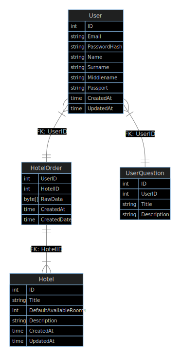

# Сайт "Путешествия"  
7 семестр, 2023

Горбуля Александр, Б05-028

Идея проекта: аналог сайтов для Путешествий.

Использование сервиса будет разрешено только авторизованными пользователям. Поэтому страницу авторизации можно назвать первой, с которой столкнется пользователь (с возможностью регистрации).

Основные сценарии после авторизации / регистрации:

- На главной странице опция"Где жить?": пользователь вводит город, даты заезда и отъезда, количество персон. Система подбирает отели в выбранном городе с возможностью сортировки по некоторым параметрам (цена, количество звезд).
- Страница отелей:  
Отели перечислены сверху вниз, есть возможность использовать фильтры для сортировки.
У каждого отеля есть - кол-во звезд, кол-во отзывов, средняя оценка, изображение, а также кнопка "Бронь", которая ведет на страницу с покупкой.
- Страница "Брони":
Здесь будет указан рейс / отель, покупаемый пользователем. Возможно какая-то дополнительная информация / опции. Кнопка подтверждения брони.

## Ссылка на дизайн в Figma.

[Проект в Figma (view режим)](https://www.figma.com/file/NzLt5FEvc58SSfeE6gVSAl/Travel-Go?type=design&node-id=0%3A1&mode=design&t=m5OOaWEUxNn41kkl-1)  

## Entity-Relation Diagram.

## Business Logic Pipeline.

